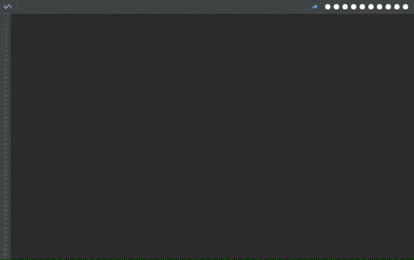

# Daily

#### Staying updated is a huge hassle. Daily was made by developers for developers to help us focus on code instead of searching for news.

Being a brilliant developer means that you should always strive to learn more and stay most updated about the latest technologies out there. Every single day new and updated development technologies are being released across the web. For us as developers, staying updated is a huge hassle. Daily was made by developers for developers to help us focus on code instead of constantly search for news around the web. 

Don’t bother looking anywhere else, simply install the extension, open a new tab and you’re all set :wink:

----

### We built this repository to get your feedback! 

[Open a new issue](https://github.com/elegantmonkeys/daily/issues/new) with your feedback / suggestion / bug report or whatever you would like to share and we will take it from there.

----

#### Check us out:

- [Chrome Web Store](https://bit.ly/chromedaily)
- [Firefox Add-ons](https://bit.ly/firefoxdaily)
- [Product Hunt](https://www.producthunt.com/posts/daily-7)

